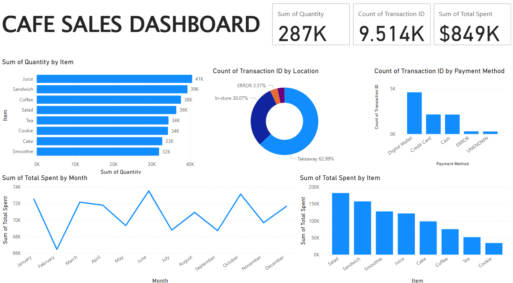

## 📊 **Dataset**
- **Sumber**: https://www.kaggle.com/datasets/ahmedmohamed2003/cafe-sales-dirty-data-for-cleaning-training
- **Deskripsi**: Dataset sintesis yang berisi 10.000 baris mengenai data penjualan di cafe. dataset masih kotor, memiliki missing values dan data yang tidak konsisten
- **Jumlah Data**: 10.000 baris dan 8 kolom
- **Fitur Utama**:
  - `Transaction ID`: [Penjelasan]
  - `Item`: [Penjelasan]
  - `Quantity`: [Penjelasan]
  - `Price Per Unit`: [Penjelasan]
  - `Total Spent`: [Penjelasan]
  - `Payment Method`: [Penjelasan]
  - `Location`: [Penjelasan]
  - `Transaction Date`: [Penjelasan]

## 🛠 **Teknologi yang Digunakan**
- **Python** (pandas, numpy, matplotlib, seaborn)
- **Jupyter Notebook** untuk eksplorasi data
- **Power BI** untuk dashboard interaktif

## 🔍 **Data Cleaning**
1. **Mengganti tipe kolom**: 
      - mengganti kolom Quantity, Price Per Unit, Total Spent menjadi tipe numeric
      - mengganti kolom Transaction date menjadi tipe date

2. **Mengisi nilai null** :
      - mengisi nilai nul pada kolom **item** dengan memanfaatkan kolom price per unit dan disesuaikan dengan harga itemnya
      - mengisi nilai null pada kolom **price per unit** dengan menggunakan nilai hasil pembagian dari kolom total spent dan quantity
      - mengisi nilai null pada kolom **Total Spent** menggunakan nilai hasil pembagian kolom quantity dan price per unit
      - mengisi nilai null pada kolom **Quantity** menggunakan nilai hasil pembagian kolom Total Spent dan price per unit
      - mengisi nilai null pada kolom **Payment Method** dan **Location** menggunakan nilai mode nya

3. **Menghapus baris yang berisi nilai null** : setelah nilai null diisi dengan nilai yang lain, tetapi masih ada nilai yang tidak bisa diisi. Maka, baris tersebut akan dihapus

## 📊 **Dashboard Power BI**
Berikut tampilan dashboard yang telah dibuat:

